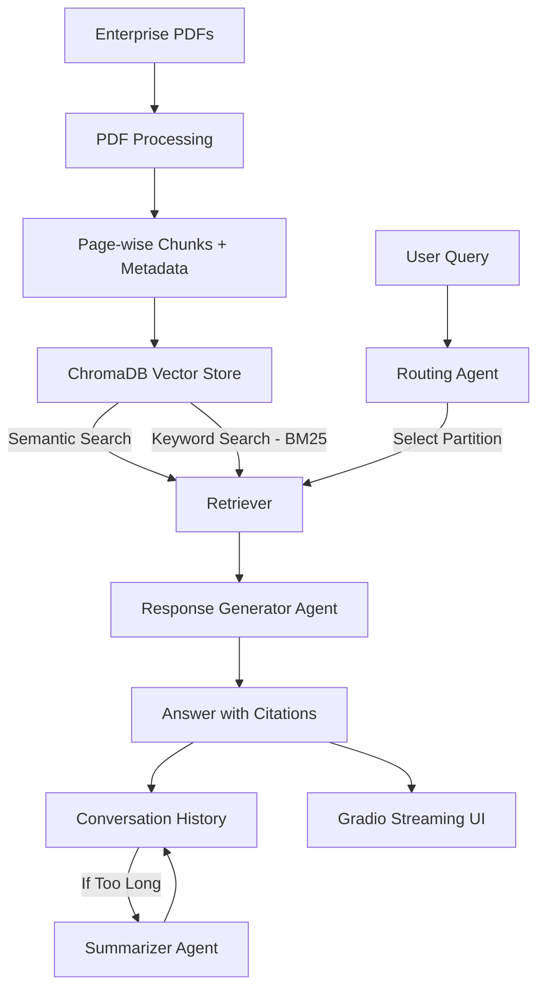

# 🧠 Agentic Enterprise Search System

This repository contains a **working MVP of an agentic, context-aware enterprise search system** built as part of the **Lyzr.ai AI Engineer assignment**.

The system goes beyond basic semantic search by combining **hybrid retrieval (semantic + keyword)** with **agentic orchestration**, **conversation memory**, and **citation-backed responses**.

---

## 🚀 Key Features

- 📄 **Enterprise document ingestion** (PDF-based)
- 🔍 **Hybrid search**
  - Semantic search using embeddings
  - Keyword search (BM25)
- 🧠 **Agentic RAG architecture**
  - Routing Agent (decides which document partition to search)
  - Response Generator Agent (grounded answers with citations)
  - Summarizer Agent (compresses long conversation history)
- 🧾 **Page-level citations** for answer authenticity
- 💬 **Streaming chatbot UI** built with Gradio
- 🔁 **Conversation-aware context handling**
- 🔌 **LLM-agnostic design** (Gemini / OpenAI supported)

---

## 📂 Project Structure

```
├── app.py                          # Gradio streaming chatbot app
├── data/                           # Enterprise PDF documents
│   ├── IBM PurchaseTerms.pdf
│   ├── IBM Standard Terms and Conditions.pdf
│   ├── International Agreement for Acquisition of Software Maintenance.pdf
│   └── International Program License Agreement.pdf
└── src/
    ├── agents.py                   # LangGraph-based agents
    ├── chroma_db.py                # Vector DB + hybrid search
    └── doc_processing.py           # PDF ingestion & chunking
```

---

## 🏗️ Architecture Overview



---

## 🧠 Agentic Design

### 1️⃣ Routing Agent
- Uses an LLM to decide **which document partition** is most relevant
- Prevents unnecessary retrieval across unrelated documents

### 2️⃣ Retrieval Layer
- Hybrid scoring:
  - Vector similarity (embeddings)
  - Keyword relevance (BM25)
- Partition-aware filtering for enterprise-scale efficiency

### 3️⃣ Response Generator Agent
- Generates answers **strictly grounded in retrieved evidence**
- Adds **inline citations** referencing document name and page number

### 4️⃣ Summarizer Agent
- Conditionally triggered when conversation history exceeds a word limit
- Maintains context without exceeding LLM limits

---

## 🧾 Example Output

> The agreement may be terminated upon material breach by either party.  
> **[IBM Standard Terms and Conditions, Page 14]**

---

## 🖥️ Running the App

### 1️⃣ Install Dependencies

```bash
pip install gradio chromadb sentence-transformers rank-bm25 langgraph langchain python-dotenv
```

### 2️⃣ Set LLM API Key

Create a `.env` file:

```env
GEMINI_API_KEY=your_gemini_api_key_here
# OR
OPENAI_API_KEY=your_openai_api_key_here
```

### 3️⃣ Run the App

```bash
python app.py
```

Open in browser:

```
http://127.0.0.1:7860
```

---

## 🔍 Why This Goes Beyond Semantic Search

- Uses **LLM reasoning** to route queries
- Maintains **conversation-level context**
- Enforces **evidence-only answer generation**
- Produces **auditable, citation-backed outputs**
- Designed for **enterprise-scale extensibility**

---

## 🛠️ Technologies Used

- Python
- Gradio (UI + streaming)
- LangGraph (agent orchestration)
- ChromaDB (vector storage)
- Sentence Transformers (embeddings)
- BM25 (keyword retrieval)
- Gemini / OpenAI LLMs

---

## 📌 Notes for Reviewers

- The system is **LLM-agnostic**
- FastAPI integration can be added trivially
- Vector DB can be swapped with Milvus for scale
- Designed to mirror real enterprise search systems

---

## ✅ Conclusion

This project demonstrates how **agentic architectures** can power intelligent, trustworthy, and context-aware enterprise search systems — aligning closely with modern AI-first enterprise platforms
